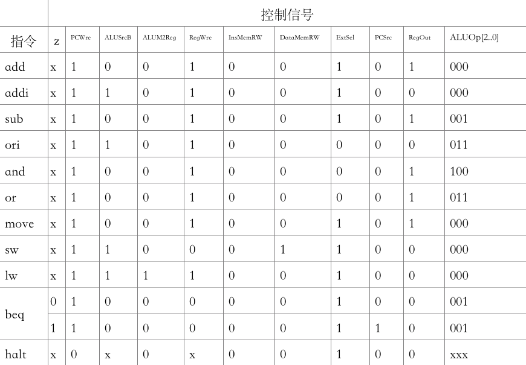
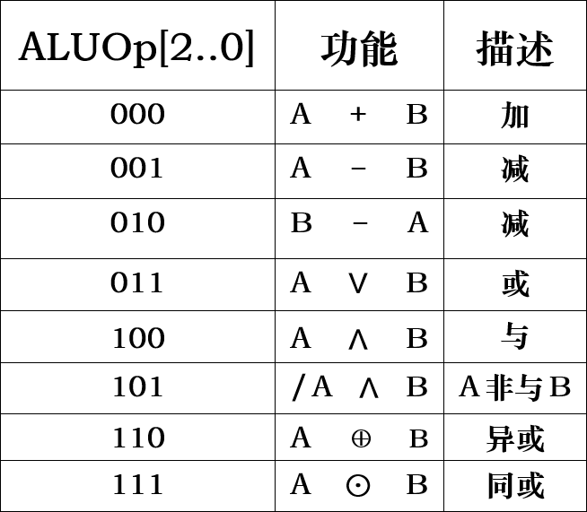
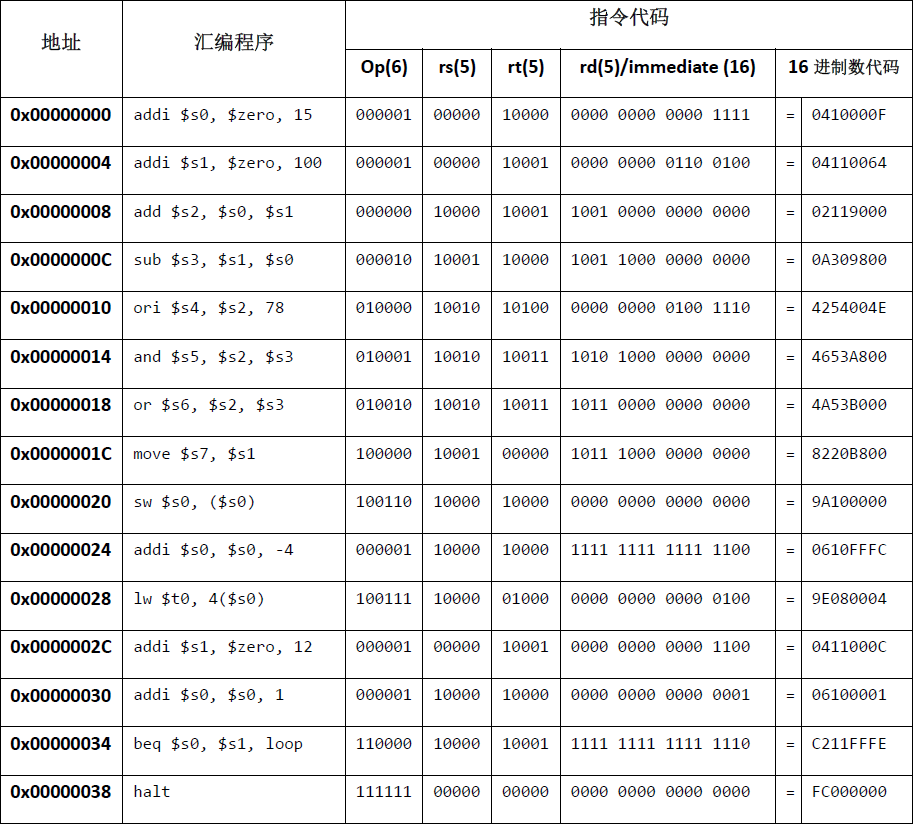

#单周期CPU设计

##一、 实验目的
1. 掌握单周期CPU数据通路图的构成、原理及其设计方法；  
2. 掌握单周期CPU的实现方法，代码实现方法；  
3. 认识和掌握指令与CPU的关系；  
4. 掌握测试单周期CPU的方法。  

##二、 实验内容
设计一个单周期CPU，该CPU至少能实现以下指令功能操作。需设计的指令与格式如下：  
==> 算术运算指令  
1. add  rd , rs, rt  （说明：以助记符表示，是汇编指令；以代码表示，是机器指令）
  
功能：rd←rs + rt。reserved为预留部分，即未用，一般填“0”。  
  
2. addi  rt , rs ,immediate  
  
功能：rt←rs + (sign-extend)immediate；immediate符号扩展再参加“加”运算。  
  
3. sub  rd , rs , rt  
  
完成功能：rd←rs - rt  
  
==> 逻辑运算指令  
4. ori  rt , rs ,immediate  
  

功能：rt←rs | (zero-extend)immediate；immediate做“0”扩展再参加“或”运算。 
  
5. and  rd , rs , rt  
  
功能：rd←rs & rt；逻辑与运算。  
  
6. or  rd , rs , rt  
  
功能：rd←rs | rt；逻辑或运算。 
  
 ==> 传送指令  
7. move  rd , rs  
  
功能：rd←rs + $0 ；$0=$zero=0。  

==> 存储器读/写指令  
8. sw  rt ,immediate(rs) 写存储器  

功能：memory[rs+ (sign-extend)immediate]←rt；immediate符号扩展再相加。  
  
9. lw  rt , immediate(rs) 读存储器  
  
功能：rt ← memory[rs + (sign-extend)immediate]；immediate符号扩展再相加。  
  
 ==> 分支指令  
10. beq  rs,rt,immediate  
  
功能：if(rs=rt) pc←pc + 4 + (sign-extend)immediate <<2；  
  
特别说明：immediate是从PC+4地址开始和转移到的指令之间指令条数。immediate符号扩展之后左移2位再相加。为什么要左移2位？由于跳转到的指令地址肯定是4的倍数（每条指令占4个字节），最低两位是“00”，因此将immediate放进指令码中的时候，是右移了2位的，也就是以上说的“指令之间指令条数”。

==> 停机指令  
11. halt  
  
功能：停机；不改变PC的值，PC保持不变。  
  
  
###实验原理
单周期CPU指的是一条指令的执行在一个时钟周期内完成，然后开始下一条指令的执行，即一条指令用一个时钟周期完成。电平从低到高变化的瞬间称为时钟上升沿，两个相邻时钟上升沿之间的时间间隔称为一个时钟周期。时钟周期一般也称振荡周期（如果晶振的输出没有经过分频就直接作为CPU的工作时钟，则时钟周期就等于振荡周期。若振荡周期经二分频后形成时钟脉冲信号作为CPU的工作时钟，这样，时钟周期就是振荡周期的两倍。）  
    CPU在处理指令时，一般需要经过以下几个步骤：  
    1. 取指令(IF)：根据程序计数器PC中的指令地址，从存储器中取出一条指令，同时，PC根据指令字长度自动递增产生下一条指令所需要的指令地址，但遇到“地址转移”指令时，则控制器把“转移地址”送入PC，当然得到的“地址”需要做些变换才送入PC。  
    2. 指令译码(ID)：对取指令操作中得到的指令进行分析并译码，确定这条指令需要完成的操作，从而产生相应的操作控制信号，用于驱动执行状态中的各种操作。  
    3. 指令执行(EXE)：根据指令译码得到的操作控制信号，具体地执行指令动作，然后转移到结果写回状态。  
    4. 存储器访问(MEM)：所有需要访问存储器的操作都将在这个步骤中执行，该步骤给出存储器的数据地址，把数据写入到存储器中数据地址所指定的存储单元或者从存储器中得到数据地址单元中的数据。  

###CPU结构图

###Control Unit 控制信号与指令关系

###ALU功能表

###测试样例

